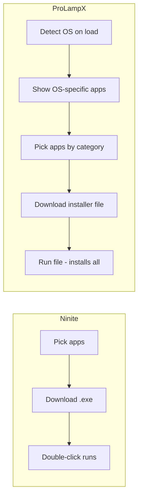
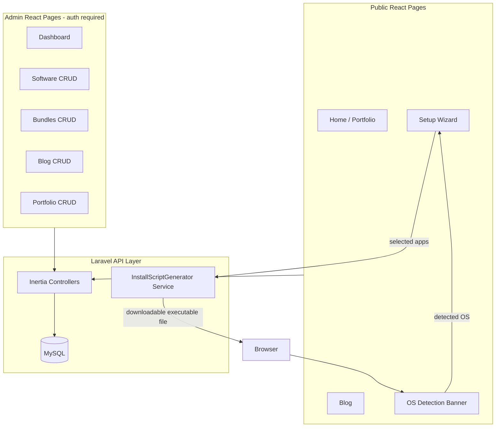
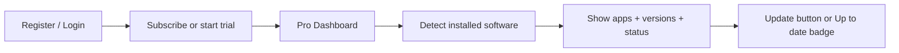
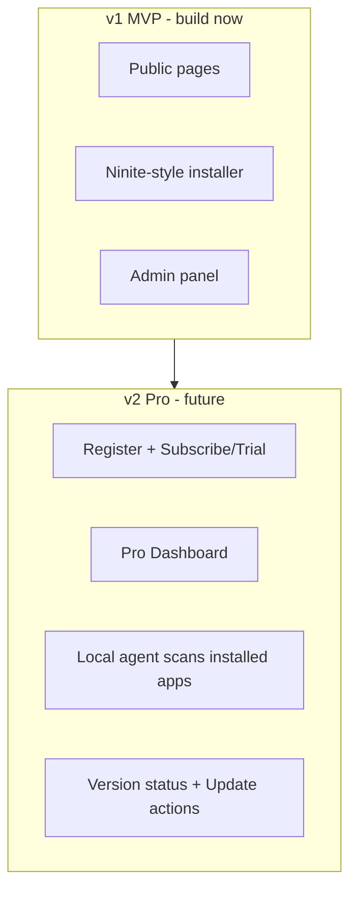

# ProLampX — Laravel + React (unified stack)

## Reference: [Ninite.com](https://ninite.com/) — our model + our advantage

[Ninite](https://ninite.com/) is the best reference for the installer UX:

1. **Pick apps** from a categorized checklist (Browsers, Developer Tools, Media, etc.)
2. **Download** a custom installer
3. **Run it** — it starts working immediately, no choices, no toolbars, installs in background
4. Apps download from **official publisher sites** via package managers

**What Ninite does NOT do (our differentiator):**
- Ninite is **Windows-only** — no macOS or Ubuntu support
- Ninite shows **all Windows apps to everyone** — no OS detection
- **ProLampX** detects the user's OS on page load and shows **only apps available for that OS**
- User can override OS manually if detection is wrong (e.g. Linux → Ubuntu)



**Ninite-style promises we match:**
- Start working as soon as you run the file
- No extra choices or junk during install
- Install latest stable versions from official sources
- Skip toolbars / bundled crap
- Do all work automatically in sequence

---

## Recommendation on your one-click install idea

**This is a strong, viable product concept** — same category as [Ninite](https://ninite.com/), but multi-OS with smart detection. For **free/open-source software**, it works very well via official package managers:

| OS | Package manager | Example |
|---|---|---|
| Windows | `winget` (primary), Chocolatey (fallback) | `winget install -e --id Microsoft.VisualStudioCode` |
| macOS | Homebrew | `brew install --cask visual-studio-code` |
| Ubuntu/Linux | `apt`, `snap`, `flatpak` | `sudo apt install -y git curl` |

**Software policy (MVP):** Only **free** and **freeware** apps — all auto-installable via package managers. No paid software in the catalog at launch.

**Future (planned, not built in MVP):** Paid apps may be added later behind **subscriptions**. Schema will reserve fields for this; no paid-install logic, manual steps, or subscription UI in the first release.

---

## Install delivery — Ninite-style executable file

**Same as Ninite:** user picks apps → downloads **one custom installer file** → runs it → installation starts automatically.

**Unlike Ninite:** we generate OS-specific files (`.bat` / `.command` / `.sh`) based on detected OS, not a Windows-only `.exe`.

**What we generate:** One **downloadable executable file** per setup. The user downloads it, then **double-clicks (Windows/macOS)** or **runs in terminal (Ubuntu)** — installation starts immediately. No copy-paste of commands.

**Important:** The file is **not** an offline installer bundle. It is a small launcher that, when run, calls `winget`, `brew`, or `apt` to **download and install each selected program from the internet**.

**Do NOT show a list of separate commands per app.**

| OS | Generated file | How user runs it | What happens on run |
|---|---|---|---|
| **Windows** | `prolampx-setup.bat` | Double-click in Explorer **or** run in CMD/PowerShell | Opens terminal, runs `winget install` for each selected app |
| **macOS** | `prolampx-setup.command` | Double-click in Finder **or** run in Terminal | Opens Terminal, runs `brew install` for each selected app |
| **Ubuntu** | `prolampx-setup.sh` | `chmod +x` once, then double-click (if enabled) **or** `./prolampx-setup.sh` in terminal | Runs `apt`/`snap` installs for each selected app |

**Why these formats:**
- **`.bat` on Windows** — double-click works out of the box (no PowerShell execution-policy issues like raw `.ps1`)
- **`.command` on macOS** — Apple's standard for double-click-to-run terminal scripts
- **`.sh` on Ubuntu** — executable shell script; chmod +x on download (or user runs with `bash file.sh`)

**What happens when the file runs (internet required):**
1. Terminal/console window opens (or uses existing terminal)
2. Script checks package manager is available (`winget` / `brew` / `apt`)
3. Each selected app downloads and installs automatically in sequence
4. Progress messages shown in the window

**Setup wizard UI after generation:**
1. **"Download installer"** — one button, downloads the OS-matched executable file
2. Short instructions: *"Double-click the file (Windows/Mac) or run in terminal (Ubuntu)"*
3. Optional collapsible **"View what this installer does"** — read-only preview of commands inside
4. Note: **Internet required** when running the file

**Optional fallback (not primary):** one-liner for advanced users who prefer not to download:
```powershell
irm https://prolampx.com/s/{token}/run.bat | iex   # Windows
curl -fsSL https://prolampx.com/s/{token}/run.sh | bash   # Mac/Ubuntu
```

**Backend:** store generated file content in `generated_setups` with token. Serve with correct `Content-Type` and `Content-Disposition: attachment` so browser downloads as executable file.

---

## Architecture (one stack, no Filament)



**Stack:**
- **Laravel 13** (latest, released March 2026; requires PHP 8.3+) with official **React starter kit** (`laravel new` → React)
- **Inertia.js + React 19 + TypeScript + Tailwind v4** (included in starter kit)
- **MySQL** database
- **Laravel Fortify** auth (included) — keep starter kit auth as-is; **comment out register routes/UI in v1**, uncomment in v2
- **User roles:** `super_admin`, `admin`, `customer` — seeded in v1; register assigns `customer` in v2
- **No Filament, no Livewire** — admin is React pages under `/admin/*` with role middleware
- **SEO + Google AdSense** in v1 on every public page
- **Performance-first** — optimized queries, caching, and frontend per Laravel + Inertia + React docs

**Project location:** scaffold into [`/var/www/prolampxApp`](/var/www/prolampxApp) (currently empty; PHP 8.4.22 available)

---

## Phase 1 — Project bootstrap

1. Install/update Laravel CLI: `composer global require laravel/installer`
2. Create project in workspace:
   ```bash
   cd /var/www
   laravel new prolampxApp
   # Select: React starter kit, MySQL, run migrations
   ```
3. Configure `.env` for MySQL:
   - `DB_CONNECTION=mysql`
   - `DB_DATABASE=prolampx`
   - Create database via MySQL
4. Run `php artisan migrate`, `npm install`, `npm run build`
5. Seed `super_admin` + `admin` users + sample data

---

## Phase 2 — Database schema (v2-ready from day one)

**Principle:** Create **all tables and columns in v1** so v2 needs **no migrations on existing tables** — only uncomment routes/UI and enable features.

### Users & auth

| Table / column | v1 usage | v2 usage |
|---|---|---|
| `users.role` | `super_admin`, `admin` (seeded); `customer` exists but unused | Register creates `customer` |
| `users.stripe_customer_id` | nullable, unused | Stripe billing |
| `users.trial_ends_at` | nullable, unused | Free trial tracking |

**Roles:**

| Role | Access |
|---|---|
| `super_admin` | Full admin + manage other admins |
| `admin` | Admin panel CRUD (software, blog, portfolio, bundles) |
| `customer` | Public site + Pro dashboard (v2) |

### Content tables (with SEO columns from v1)

| Table | Columns (include SEO on all public content) |
|---|---|
| `portfolio_items` | title, slug, content, image, `meta_title`, `meta_description`, `og_image`, `published_at` |
| `blog_posts` | title, slug, body, cover, `meta_title`, `meta_description`, `meta_keywords`, `og_image`, `canonical_url`, `published_at` |
| `software` | name, slug, icon, category, `license_type`, `access_tier`, `latest_version`, description, `meta_title`, `meta_description`, `meta_keywords`, `og_image`, `is_featured` |
| `software_install_commands` | `software_id`, `os`, `package_manager`, `command`, `notes` |
| `bundles` | name, slug, description, `meta_title`, `meta_description`, `is_featured` |
| `bundle_software` | pivot |
| `pages` | CMS pages (About, Privacy) with SEO fields |
| `generated_setups` | token, os, software JSON, file content, filename, expires_at |

### v2 tables (created in v1, empty/unused until v2)

| Table | Purpose |
|---|---|
| `subscriptions` | `user_id`, plan, status, `stripe_id`, `trial_ends_at`, `ends_at` |
| `user_machines` | `user_id`, name, token, os, `last_seen_at` |
| `machine_software` | `user_machine_id`, `software_id`, `installed_version`, `last_scanned_at` |

**Key design:** install commands + SEO + subscription schema all in v1 migrations. v2 = flip features on, not alter tables.

---

## Phase 2b — Auth & roles (minimal v1 changes)

Use **Laravel Fortify** from the React starter kit unchanged.

**v1 — comment out registration (no schema changes):**
- In `routes/web.php` or Fortify config: comment out `register` routes
- Hide Register link in React nav (`Auth/Register.tsx` route disabled)
- Login remains active for `super_admin` / `admin` only
- Middleware: `role:super_admin,admin` on `/admin/*`

**v2 — uncomment registration:**
- Uncomment Fortify register routes + Register nav link
- New users auto-assigned `role = customer`
- Redirect customers to `/pro/dashboard` after subscribe/trial

```php
// v1: routes/web.php
// Fortify::registerView(...) — commented out
// Route::post('/register', ...) — commented out

// v2: uncomment same lines — no auth refactor needed
```

---

## Phase 3 — OS detection (our edge over Ninite)

Ninite shows one big Windows app list to everyone. **ProLampX detects OS on load** and filters the catalog automatically.

**Client-side hook** (`resources/js/hooks/useDetectedOS.ts`):
- Parse `navigator.userAgent` + `navigator.platform`
- Map to: `windows` | `macos` | `ubuntu` | `linux` | `unknown`
- Ubuntu is hard to distinguish from generic Linux in UA — if Linux detected, show **"Are you on Ubuntu?"** toggle; remember in `localStorage`

**Server-side fallback:**
- Laravel middleware parses `User-Agent` and shares `detectedOS` via Inertia shared props

**UX on load (Setup page):**
- Banner: *"Detected: Windows — showing apps for your system"*
- **Only show apps that have install commands for the detected OS** (hide Windows-only apps on Mac, etc.)
- OS switcher dropdown in header if user wants to browse another OS (e.g. building a setup for a different machine)
- Categories still shown (like Ninite: Browsers, Developer Tools, Media, Utilities) but contents are OS-filtered

---

## Phase 4 — Public pages (React)

| Route | Page | Features |
|---|---|---|
| `/` | Home | Portfolio hero, SEO, AdSense, CTA to Setup |
| `/blog` | Blog index | Paginated posts, SEO, AdSense |
| `/blog/{slug}` | Blog post | Content, SEO meta, JSON-LD Article, AdSense |
| `/software` | Software index | Catalog landing, SEO, AdSense |
| `/software/{slug}` | Software detail | Per-app page for SEO ranking, install CTA, AdSense |
| `/setup` | Ninite-style app picker | OS-filtered checkboxes, SEO, AdSense |
| `/setup/generate` | POST endpoint | Accepts `software_ids[]` + `os`, stores executable, returns download URL |
| `/s/{token}/prolampx-setup.bat` | GET (public) | Windows installer (double-click) |
| `/s/{token}/prolampx-setup.command` | GET (public) | macOS installer (double-click) |
| `/s/{token}/prolampx-setup.sh` | GET (public) | Ubuntu installer (terminal) |

**Setup page UX (mirrors [ninite.com](https://ninite.com/)):**

```
┌─────────────────────────────────────────────────────┐
│  Detected: Windows 11  [Change OS ▼]                │
├─────────────────────────────────────────────────────┤
│  Web Browsers          Developer Tools              │
│  ☑ Chrome              ☑ Git                        │
│  ☐ Firefox             ☑ VS Code                    │
│  ☐ Edge                ☐ Node.js                    │
│                                                     │
│  Media                 Utilities                    │
│  ☑ VLC                 ☑ 7-Zip                     │
│  ...                   ...                          │
├─────────────────────────────────────────────────────┤
│         [ Get Your ProLampX Installer ]             │
└─────────────────────────────────────────────────────┘
```

**Flow:**
1. Page loads → OS detected → show **only apps for that OS**, grouped by category
2. User checks/unchecks apps (popular ones can be pre-checked)
3. Click **"Get Your ProLampX Installer"** (Ninite's "Get Your Ninite")
4. Download `prolampx-setup.bat` / `.command` / `.sh`
5. User runs file → installs all selected apps automatically from the internet

---

## Phase 4b — SEO (v1)

SEO on **every public page** to rank blog posts and software pages in search engines.

**Per-page SEO (via Inertia `<Head>` + DB fields):**
- `meta_title`, `meta_description`, `meta_keywords`
- Open Graph tags (`og:title`, `og:description`, `og:image`)
- Canonical URLs
- JSON-LD structured data:
  - `WebSite` + `Organization` on home
  - `Article` on blog posts
  - `SoftwareApplication` on `/software/{slug}`

**Technical SEO:**
- `sitemap.xml` — auto-generated (home, blog, software, bundles)
- `robots.txt` — allow crawlers
- Clean slugs on all content (`/blog/install-vscode-ubuntu`, `/software/visual-studio-code`)
- Semantic HTML (`h1`, `article`, `nav`)
- Fast pages (Vite, lazy images, alt text on icons/covers)

**Admin:** SEO fields on blog, software, bundles, and pages forms (meta title/description editable per item).

---

## Phase 4c — Google AdSense (v1)

Monetize traffic via [Google AdSense](https://www.google.com/adsense/) — primary revenue in v1 (subscriptions in v2).

**Implementation:**
- AdSense script in main layout (`resources/js/layouts/PublicLayout.tsx`)
- `ADSENSE_CLIENT_ID` in `.env` (never commit real ID to repo)
- Reusable `<AdSlot position="..." />` component with predefined slots:
  - `header-banner` — below nav
  - `sidebar` — blog/software detail pages
  - `in-content` — between blog sections
  - `setup-footer` — below app picker on `/setup`
- Responsive ad units; avoid placing ads inside installer download flow (bad UX)
- `ads.txt` route served from public or storage
- Privacy policy page (required by AdSense) — CMS page in admin

**v1:** AdSense live on all public pages. **v2:** May reduce ad density on `/pro/*` for paying customers.

---

## Future: ProLampX Pro (v2 — planned, not MVP)

**MVP (v1)** stays simple: public site, free/freeware catalog, Ninite-style installer, SEO, AdSense. **Register commented out** — login only for admins.

**v2** uncomments register routes; customers get Pro dashboard + subscriptions. **No DB migration changes** — tables/columns already exist from v1.

### v2 user flow



1. User **registers** and **subscribes** (or starts free trial) via Stripe
2. Redirected to **`/pro/dashboard`** (Pro user area — separate from admin `/admin`)
3. System **detects installed software** on their machine (name + current version)
4. Dashboard shows a **managed list**:
   - App name, icon, installed version, latest available version
   - Status badge: **Up to date** or **Update available**
   - **Update** button (generates/runs update for that app or bulk-update all outdated)
5. Optional: saved bundles, install history, multiple machines

### How installed-software detection works (v2)

Browsers cannot scan the local machine directly. v2 will use a **small ProLampX agent** (CLI or lightweight desktop helper) linked to the user's account:

| OS | Detection method |
|---|---|
| Windows | `winget list`, registry queries |
| macOS | `brew list --versions`, `/Applications` scan |
| Ubuntu | `dpkg -l`, `snap list`, `apt list --installed` |

Agent runs locally (or is embedded in the Pro installer), reports inventory to Laravel API, dashboard compares against catalog `latest_version` (maintained in admin).

### v2 schema (already in v1 migrations — enable in v2 only)

| Table / field | Status in v1 | Enabled in v2 |
|---|---|---|
| `users.role = customer` | column exists; no public register | register assigns customer |
| `subscriptions` | table exists; empty | Stripe billing |
| `user_machines`, `machine_software` | tables exist; empty | Pro agent reports inventory |
| `software.latest_version`, `access_tier` | columns exist; defaults set | dashboard + gating |

### v2 routes (uncomment / add in v2 only)

| Route | Purpose |
|---|---|
| `/register` | Uncomment Fortify register (v2) |
| `/login` | Active in v1 for admins; public in v2 |
| `/pricing` | Plans + trial CTA |
| `/pro/dashboard` | Installed apps, versions, update status |
| `/pro/machines` | Linked devices |
| `/pro/bundles` | Saved custom bundles |

### v2 middleware

- `auth` + `subscribed` (or `onTrial`) — gate `/pro/*` routes
- Installer generator may include Pro user token for inventory sync (optional)

**No v2 code in MVP.** MVP only seeds `access_tier = public` on all software and uses anonymous installer flow.

---

**No v2 UI in MVP.** Register routes commented out. Subscription/Pro tables exist but unused. v2 = uncomment routes + build Pro pages.

---

## Phase 5 — Admin panel (React, same app)

Routes under `/admin`:

| Route | Middleware | Purpose |
|---|---|---|
| `/admin` | `auth`, `role:super_admin,admin` | Dashboard stats |
| `/admin/portfolio` | `auth`, `role:super_admin,admin` | CRUD portfolio |
| `/admin/blog` | `auth`, `role:super_admin,admin` | CRUD blog + SEO fields |
| `/admin/software` | `auth`, `role:super_admin,admin` | CRUD software + SEO + install commands |
| `/admin/bundles` | `auth`, `role:super_admin,admin` | CRUD bundles + SEO |
| `/admin/users` | `auth`, `role:super_admin` | Manage admin users (super_admin only) |

**Reuse starter kit layout:** extend existing authenticated dashboard layout from Laravel React kit — add admin sidebar nav.

**File uploads:** Laravel storage for blog covers, portfolio images, software icons (`storage/app/public` + `php artisan storage:link`).

---

## Phase 6 — InstallScriptGenerator service

New service: `app/Services/InstallScriptGenerator.php`

```php
// Input: Collection<Software>, OS enum
// Output: {
//   content: string,              // executable file body
//   filename: string,             // prolampx-setup.bat | .command | .sh
//   mime_type: string,
//   download_url: string,         // /s/{token}/prolampx-setup.bat
//   warnings: [...]               // e.g. missing package manager
// }
```

**Windows `prolampx-setup.bat` (double-click or CMD):**
```bat
@echo off
title ProLampX Setup
echo Installing selected software...
winget install -e --id Git.Git --accept-package-agreements --accept-source-agreements
winget install -e --id Microsoft.VisualStudioCode --accept-package-agreements --accept-source-agreements
echo Done. Press any key to close.
pause
```

**macOS `prolampx-setup.command` (double-click in Finder):**
```bash
#!/bin/bash
cd "$(dirname "$0")"
echo "Installing selected software..."
brew install git node
echo "Done."
read -p "Press Enter to close..."
```

**Ubuntu `prolampx-setup.sh` (terminal):**
```bash
#!/bin/bash
set -e
echo "Installing selected software..."
sudo apt update && sudo apt install -y git curl nodejs
echo "Done."
```

Logic:
- Load `software_install_commands` for selected OS (all apps are free/freeware in MVP)
- Build **one runnable executable file** with all installs inside
- Set correct shebang / `@echo off` / pause so window stays open for user feedback
- Persist to `generated_setups`; serve with `Content-Disposition: attachment`

---

## Phase 7 — Release phases

### v1 — MVP (build now)

- Laravel 13 + React scaffold + MySQL
- **v2-ready DB** — all tables/columns including subscriptions, roles, SEO fields
- **Fortify auth** — login for admins; **register routes commented out**
- **Roles:** `super_admin`, `admin` (seeded), `customer` (reserved)
- OS detection + free/freeware catalog
- Ninite-style setup + executable installer
- **SEO** on all pages (meta, OG, JSON-LD, sitemap)
- **Google AdSense** on public pages
- Software detail pages (`/software/{slug}`) for SEO
- Admin CRUD + super_admin user management
- **Performance optimizations** (caching, indexes, eager loading, lean Inertia props)
- **No Pro dashboard, no subscriptions UI**

### v1.1 — polish (optional, post-MVP)

- User accounts (save/share custom bundles) — still free
- Script expiry, shareable links, basic analytics

### v2 — ProLampX Pro (future — uncomment + enable)

- **Uncomment** Fortify register routes + Register nav link
- New users → `customer` role → subscribe/trial (Stripe uses existing `subscriptions` table)
- **Pro dashboard** (`/pro/dashboard`) — uses existing `user_machines`, `machine_software`
- Local Pro agent for inventory scan
- `access_tier` gating on premium apps
- Ad-free or reduced ads on `/pro/*` for subscribers



---

## Phase 8 — Performance & optimization (built into v1)

Everything must be **fast and optimized from day one** — quick page loads, minimal API/DB round-trips, fast installer generation. Follow official [Laravel](https://laravel.com/docs), [Inertia](https://inertiajs.com), and [React](https://react.dev) documentation patterns.

### Backend (Laravel)

| Practice | Where applied |
|---|---|
| **Eager loading** (`with()`) | Setup catalog, blog lists, admin index pages — no N+1 queries |
| **DB indexes** | `slug`, `os`, `software_id`, `published_at`, `role`, foreign keys |
| **Select only needed columns** | `Software::select([...])` on public catalog |
| **Route + config + view cache** | Production deploy: `php artisan optimize` |
| **Response caching** | Software catalog by OS (`Cache::remember`, 1h TTL, bust on admin save) |
| **Sitemap cache** | Regenerate on content change, serve cached XML |
| **Form requests + validation** | Fast fail on `/setup/generate` before DB work |
| **Installer generation** | Single query for selected software + commands; no loops hitting DB |
| **Queues (optional v1)** | Heavy tasks (sitemap regen) via `ShouldQueue` if needed |
| **API Resources** | Lean Inertia props — never pass full model graphs |

### Database (MySQL)

```sql
-- indexes on hot paths (in migrations)
software: index(slug), index(category), index(access_tier)
software_install_commands: index(software_id, os)
blog_posts: index(slug), index(published_at)
generated_setups: index(token), index(expires_at)
users: index(role)
```

- Use `utf8mb4` + InnoDB
- Paginate admin lists (25–50 per page)
- Avoid `SELECT *` on large tables in admin

### Frontend (React + Inertia + Vite)

| Practice | Where applied |
|---|---|
| **Lazy page loading** | `resolvePageComponent` + dynamic `import()` (starter kit default) |
| **Minimal Inertia props** | Only data each page needs; shared props kept small |
| **Partial reloads** | `router.reload({ only: [...] })` on OS switcher — not full page |
| **Debounced search** | Admin software/blog search (300ms) |
| **Memoization** | `useMemo` for filtered software list by OS on Setup page |
| **Image optimization** | WebP icons, lazy `loading="lazy"` on blog covers |
| **Production Vite build** | `npm run build` — tree-shaking, minification, hashed assets |
| **No blocking AdSense** | Load AdSense script `async`; never block render |

### Critical path targets

| Action | Target |
|---|---|
| Home / Setup page load | < 1.5s (cached catalog) |
| `/setup/generate` POST | < 500ms (script built in-memory) |
| Installer file download | < 200ms (pre-generated, streamed) |
| Admin list pages | < 1s with pagination |
| Blog / software detail | < 1s + SEO meta in first paint |

### Production checklist

```bash
php artisan config:cache
php artisan route:cache
php artisan view:cache
php artisan event:cache   # if events used
npm run build
# OPcache enabled on PHP (server config)
# MySQL query cache / adequate RAM
```

### Monitoring (v1)

- Laravel Telescope in **local only** (debug queries)
- Log slow queries (> 100ms) in production via `DB::listen`
- Optional: Laravel Pulse in staging for request timing

**Rule:** Every new feature must pass a quick perf check — no uncached full-table scans on public routes, no N+1 in controllers.

---

## File structure (key new files)

```
app/
  Http/Controllers/
    HomeController.php
    BlogController.php
    SetupController.php
    Admin/
      SoftwareController.php
      BundleController.php
      BlogController.php
      PortfolioController.php
  Services/InstallScriptGenerator.php
  Models/Software.php, Bundle.php, BlogPost.php, ...
resources/js/
  Pages/
    Home.tsx
    Blog/Index.tsx, Show.tsx
    Setup/Index.tsx
    Admin/Dashboard.tsx, Software/Index.tsx, ...
  hooks/useDetectedOS.ts
  components/OSBadge.tsx, ScriptPreview.tsx, SoftwarePicker.tsx, AdSlot.tsx
  components/SeoHead.tsx
database/migrations/...
database/seeders/RolesSeeder.php
app/Enums/UserRole.php
app/Http/Middleware/EnsureUserHasRole.php
app/Support/CacheKeys.php
```

---

## Risks and mitigations

| Risk | Mitigation |
|---|---|
| Wrong OS detected (Linux ≠ Ubuntu) | Manual OS override + localStorage preference |
| `winget`/`brew` package ID changes | Admin updates command in DB; no redeploy needed |
| Script fails mid-run | Generator adds comments + error handling; document re-run safety |
| Admin exposed publicly | `role:super_admin,admin` middleware; rate limit login |
| AdSense policy compliance | Privacy policy page, ads.txt, no ads on download step |
| SEO thin content | Unique descriptions per software/blog page from admin |
| Slow Setup page with many apps | Cache catalog by OS; eager load commands; paginate admin only |
| Slow installer generation | Single batched query; generate script in service, no per-app DB hits |
